# PostgreSQL on microk8s

## Motivation

We aim to conduct experiments running PostgreSQL on a microk8s cluster. Our goals include:

- Evaluating whether it is reasonable to run PostgreSQL on a microk8s cluster.
- Setting up a high-availability configuration with one primary and two secondaries using CloudNativePG.
- Utilizing external persistent storage provided by Longhorn.

---
## Overview

1. Create a VM
2. Install microk8s on the VM
3. Deploy Longhorn on microk8s
4. Deploy PostgreSQL on microk8s with CloudNativePG
5. Test failover of PostgreSQL

---

## 1. Create a VM

### Tasks Overview


1. Download an ISO image.
2. Create a VM with the ISO image, setting up a user and a password.
3. Set up Port Forwarding before starting the VM.
4. Add storage for Longhorn.
5. Start the VM.
6. Log in to the VM and start the SSH server.
7. Copy the SSH public key from the host to the VM using Port Forwarding.

### Details

There are a few options for creating a VM:

- **VirtualBox**longhorn

  - Bridge network
  - NAT network
  - NAT

- **Multipass** (Canonical, Ubuntu official)

  - NAT

We chose VirtualBox with NAT (make sure 'NAT' and 'Nat network' are
different options). After trying all of the above, we found that
**VirtualBox + NAT** was the most reasonable setup.


#### 1. Download an ISO image

Download an ISO image from the [Ubuntu website](https://jp.ubuntu.com/download). Make sure to download **Ubuntu Server**, not the Desktop version.

#### 2. Create a VM with the ISO image, setting up a user and a password

Go to `Machine` from VirtualBox Manager and choose `New`.

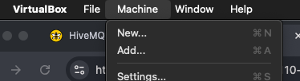


Attach the ISO image and configure the VM.

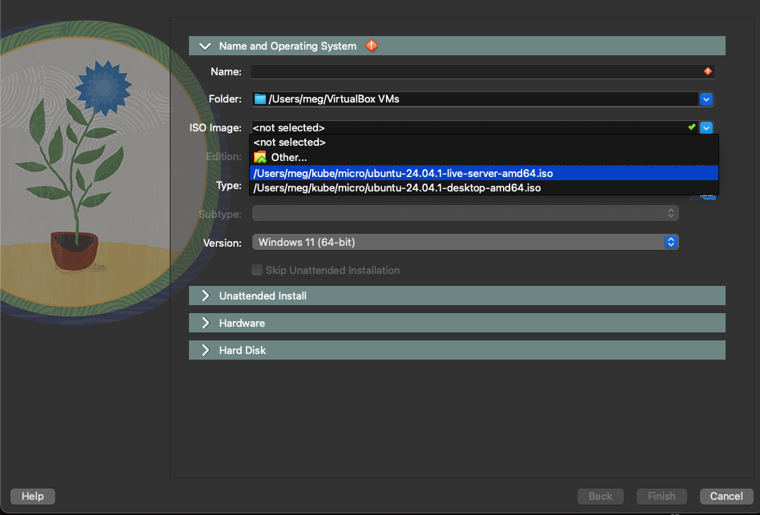

Set up:

- Admin user and password
- Hostname and domain
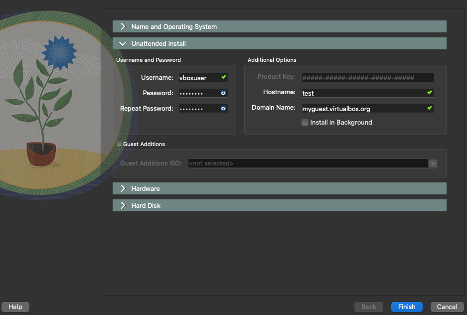

- Minimum requirements:
  - **2 vCPU**
  - **4 GiB RAM**
  - **25 GiB storage**


#### 3. Set up Port Forwarding before starting the VM

Use the VirtualBox CLI on the **host** terminal:

```sh
VBoxManage modifyvm "micro" --natpf1 "guestssh,tcp,,2222,,22"
VBoxManage modifyvm "micro" --natpf1 "kubectl_proxy,tcp,,8081,,8081"
VBoxManage modifyvm "micro" --natpf1 "apiserver,tcp,,16443,,16443"
```

These commands set up:

- **SSH port forwarding** (allows SSH from the host to the VM)
- **Kubernetes API access** (enables `kubectl proxy` from the host)
- **Kubernetes API port** (allows direct access to the microk8s API from the host)

#### 4. Add storage for Longhorn.

This part is optional. One can mount the Longhorn storage in the disk in which
the operation system is stored.  We would like to, however, have a separate
disk for Longhorn so that future expansion of the disk is easier. 

Make sure VM is not yet started.
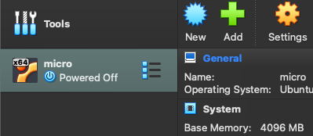

Click on 'Storage'.
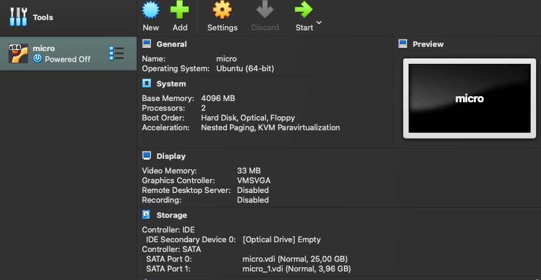

Create a new hard drive.
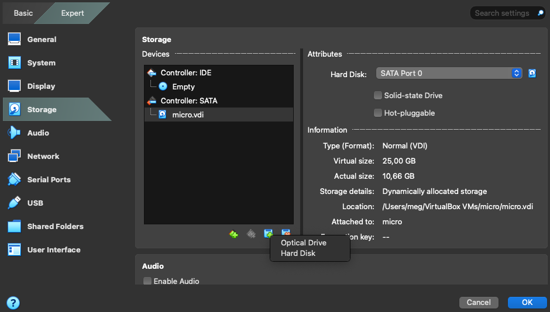

Let us say, 5GiB (= 1Gi for each postgres instances + margin).
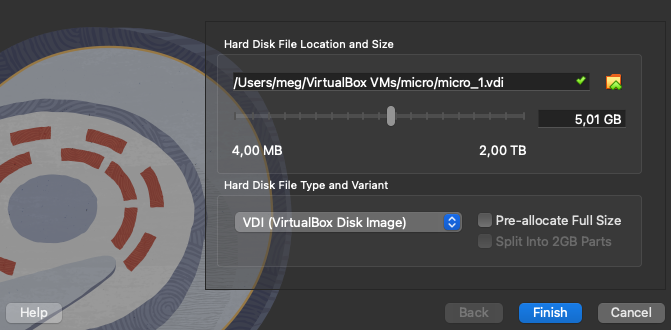

Now we have a new disk ('micro-1.vdi). We will use it to house Longhorn volume later. 
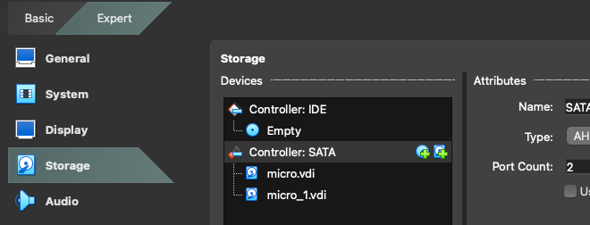

#### 5. Start the VM

Select the VM in VirtualBox Manager and click the **Start** button (green arrow).

#### 6. Log in to the VM and start the SSH server

Log in to the VM **from the VM console** (since SSH is not yet available from the host). Use the admin account you set up.

If you see a **desktop environment**, it means you installed **Ubuntu Desktop** instead of Ubuntu Server.

Run the following:

```sh
sudo apt update
sudo apt upgrade -y
sudo apt install -y openssh-server
```

Start the SSH server:

```sh
sudo systemctl start sshd
```

Enable SSH on boot:

```sh
sudo systemctl enable sshd
```

#### 7. Copy the SSH public key from the host to the VM using Port Forwarding

On the **host**:

```sh
ssh -p 2222 admin@127.0.0.1
```

This forwards the request to **port 22** on the VM.

Copy and paste the content of `~/.ssh/id_ed25519.pub` from the **host** to `~/.ssh/authorized_keys` on the **VM**.

Add an alias in `.zshrc` on the **host**:

```sh
alias micro="ssh -p 2222 admin@127.0.0.1"
```

Reload:

```sh
source ~/.zshrc
```

Test:

```sh
micro
```

You should now be able to SSH into the VM **without a password**.

---

## 2. Install microk8s

### Tasks Overview

1. Install microk8s with `snap`
2. Add yourself to the `microk8s` group
3. Open proxy with `microk8s.kubectl proxy`
4. Copy `.kube/config` to the host machine with `scp`
5. Edit `.kube/config` for port forwarding
6. Test operation from the host machine
7. Housekeeping tasks

### Details

#### 1. Install microk8s with `snap`

Log in to the VM from the host and execute

```
sudo snap remove microk8s --classic
```


#### 2. Add yourself to microk8s group

Execute

```
sudo usermod -a -G microk8s $USER
newgrp microk8s
```

So that you have a permission to execute the command ```microk8s```.
Update the user group ```microk8s```.

Test it.
```
$ microk8s.kubectl get nodes
NAME    STATUS   ROLES    AGE   VERSION
micro   Ready    <none>   17h   v1.31.5
```

Great.

Enable a few add-ons.

```
microk8s enable dns
microk8s enable dashboard
microk8s enable metric-server
microk8s enable ingress
microk8s enable storage
```

Restart microk8s with add-ons. 

```
sudo systemctl restart snap.microk8s.daemon-containerd.service
```

#### 3. Open proxy with microk8s.kubectl proxy

Let us test if we can connect from the host to microk8s cluster
(single-node cluster in our case).

On **VM**

```
microk8s.kubectl proxy \
   --address=10.0.2.X\   <---- IP of VM
   --accept-hosts='\^XXX\.XXX\.XXX\.XXX$' \ <---- IP of host
   --port=8081 <--- port to use
```

When you execute the command above, you would not come back to the
command prompt. You should keep it so, because this means now the
port is open. When you do Ctl+c, and quit, the port will be closed.  

on **host**

```
curl http://127.0.0.1:8081/api/
Forbidden
```

This is the right outcome.

#### 4. Copy .kube/config to the host machine with scp

First extract config from the cluster

On **VM**

```
microk8s config > .kube/config
```

Copy it to the host. On **host**

```
scp -P 2222 user_name@127.0.0.1:/home/user_name/.kube/config ~/
```

It looks as if you are copying from your own host, because we are port
forwarding to the VM. A request to 127.0.0.1:2222 will forwarded to
port 22 of the VM.

Check if you have config now.

```
$ cat config
```

Then move it to the right directory

```
$ mkdir ~/.kube
$ mv config ~/.kube/

```

#### 5. Edit .kube/config for port forwarding

This config file does not work as it is, because we are using port forwarding.
Look for 

```
server: https://10.0.2.15:16443
```
in config and change it to 

```
server: https://127.0.0.1:16443 
```

Now test on **host**
```
$ kubectl get no
NAME    STATUS   ROLES    AGE   VERSION
micro   Ready    <none>   17h   v1.31.5
```

All right. 

Take care a few housekeeping stuff.

On **VM**

```
sudo snap alias microk8s.kubectl k source <(k completion bash |
sed "s/kubectl/k/g")
```
[See](https://plainice.com/microk8s-bash-completion).

so that we can execute ```microk8s.kubectl``` with `k` only with an
autocompletion.

On **host** add following lines in ```.zshrc```.
```
alias k="kubectl"
```

---

## 3. Deploy Longhorn on microk8s
### Tasks Overview

1. Mount the Disk for Longhorn
2. Enable the Helm 3 add-on for microk8s.
3. Edit `longhorn-values.yaml`.
4. Stop `multipath` highjacking volume. 
5. Deploy Longhorn using Helm.
6. Set up `kubectl port-forward` for the Longhorn dashboard.
7. Access the Longhorn dashboard from the host.

### Details

#### 1. Mount the Disk for Longhorn


We will mount and format the disk we created
for Longhorn. Do all the following until before the next section on **VM**.

Check if we can see the disk.  

```sh
$ lsblk
NAME   MAJ:MIN RM   SIZE RO TYPE MOUNTPOINTS
loop0    7:0    0  63.7M  1 loop /snap/core20/2434
loop1    7:1    0 160.4M  1 loop /snap/microk8s/7661
loop2    7:2    0  44.4M  1 loop /snap/snapd/23545
sda      8:0    0    25G  0 disk
├─sda1   8:1    0     1M  0 part
└─sda2   8:2    0    25G  0 part /
sdb      8:16   0     5G  0 disk
sr0     11:0    1  1024M  0 rom
```

`sdb` is the one we created for Longhorn.

Create a partition. 
```
$ sudo fdisk /dev/sdb
```sh
- `m` : help
- `p` : print
- `n` : new
- `l` : show all partition types (usually we need only 'Linux')
- `w` : write (this is the most scaring one)


Check it
```sh
lsblk
NAME   MAJ:MIN RM   SIZE RO TYPE MOUNTPOINTS
loop0    7:0    0  63.7M  1 loop /snap/core20/2434
loop1    7:1    0 160.4M  1 loop /snap/microk8s/7661
loop2    7:2    0  44.4M  1 loop /snap/snapd/23545
sda      8:0    0    25G  0 disk
├─sda1   8:1    0     1M  0 part
└─sda2   8:2    0    25G  0 part /
sdb      8:16   0     5G  0 disk
└─sdb1   8:17   0     5G  0 part
```
Now we have `sdb1`.

Format the disk.

```sh
sudo mkfs.ext4 /dev/sdb1
mke2fs 1.47.0 (5-Feb-2023)
Creating filesystem with 1312256 4k blocks and 328656 inodes
...

```

Check if the disk `sdb1` is properly formatted. 

```sh
lsblk -f
NAME   FSTYPE FSVER LABEL UUID                                 FSAVAIL FSUSE% MOUNTPOINTS
loop0                                                                0   100% /snap/core20/2434
loop1                                                                0   100% /snap/microk8s/7661
loop2                                                                0   100% /snap/snapd/23545
sda
├─sda1
└─sda2 ext4   1.0         c61fb431-4fa7-4b27-8f0e-53b62ac243df   14.8G    34% /
sdb
└─sdb1 ext4   1.0         
9243................6463
```

All right. 

Add to `UUID` of the partition to `/etc/fstab`.
First we need to know UUID (can do that with `lsblk` as well).

```sh
$ sudo blkid /dev/sdb1
/dev/sdb1: UUID="9243....6463
```

Then add it to `/etc/fstab` so that the disk will be 
mounted automatically at every reboot. 

```sh
$ cat /etc/fstab
# /etc/fstab: static file system information.
...
UUID=9243............6463 /var/lib/longhorn ext4 defaults 0 0
```

Mount the disk immediately this time

```sh
$ sudo mount -a

mount: (hint) your fstab has been modified, but systemd still uses
       the old version; use 'systemctl daemon-reload' to reload.
```

Do that as  the machine recommended.
```sh
$ sudo systemctl daemon-reload
```


Check it.
```
$ df -H | grep sd
/dev/sda2        27G  9.0G   16G  36% /
/dev/sdb1       5.3G   33k  5.0G   1% /var/lib/longhorn
```
All right.

#### 2. Enable Helm 3 add-on for microk8s

On **VM**:
```sh
microk8s enable helm3
```

Verify that `helm3` is enabled:
```sh
microk8s.helm version
```

For convenience, create an alias:
```sh
alias helm=microk8s.helm
```

#### 3. Edit `longhorn-values.yaml`

Here  we will do two things.
- Change the number of replication of volumes from 3 to 1. 
- Add `kubelet` root directory. 

**Longhorn replicates a persistent volume
to different nodes for robustness. That means,
if we would like 3 copies of a volume, we need
at least 3 nodes. As we only have one VM, we can 
only have one volume (=primary only).**

First, add the Longhorn Helm repository:
```sh
helm repo add longhorn https://charts.longhorn.io
helm repo update
```

Pull the chart to check `values.yaml`.

```
$ helm pull longhorn/longhorn --untar
$ cd longhorn
$ less values.yaml
```

We will change the default 3 to 1 and save 
it as `longhorn-values.yaml`.

```yaml
...
persistence:
  defaultClass: true
  defaultFsType: "ext4"
  defaultClassReplicaCount: 1   # <--- this one here
...
```

Also it is critical to add `kubelet` root directory 
in `longhorn-values.yaml`. `kubelet` root directory
seems to be `/var/lib/kubelet` and linked to 
`/var/snap/microk8s/common/var/lib/kubelet`, but 
it looks like necessary to specify the latter
(`/var/lib/kubelet` ends up `applyFsGroup` problem).

```
...
csi:
  # -- kubelet root directory. When unspecified, Longhorn uses the default value.
  kubeletRootDir: "/var/snap/microk8s/common/var/lib/kubelet"
...
```

#### 4. Stop `multipath` highjacking volume. 

About the (problem)[https://longhorn.io/kb/troubleshooting-volume-with-multipath/]
and [discussion](https://github.com/longhorn/longhorn/issues/1210#issuecomment-671591451).

In short when the service `multipath` is working on the VM, the persistent volume that Longhorn created will be snatched by `multipath` and ClougNativePG cannot attach the volume to the pods it creates. 

We have two ways to cope with the problem. 

- Stop `multipathd` entirely, or
- Add `/dev/sdb1` (Longhorn disk) to blacklist. 

We will take the latter way. 

```
$ sudo sytemctl stop multipathd
```
Edit `/etc/multipath.conf` like this.
```
$ cat /etc/multipath.conf
defaults {
    user_friendly_names yes
}
blacklist {
    devnode "^sd[a-z0-9]+"
}
```

It does look we put much more disks into blacklist than necessary, but somehow `devnode "^sdb1"` did not work.

Restart `multipathd`

```
$ sudo sytemctl start multipathd
```

#### 5. Deploy Longhorn using Helm

Finally, install Longhorn on the microk8s cluster:

```sh
helm install longhorn longhorn/longhorn \
             -f longhorn-values.yaml \
             --namespace longhorn-system \
             --create-namespace
```

Check if Longhorn is running okay.

```
k get all -n longhorn-system
```

If something goes wrong, roll back the installation:
```sh
helm uninstall longhorn -n longhorn-system
```
or delete the entire namespace:
```sh
kubectl delete ns longhorn-system
```
but see the end of this report how to delete the Longhorn namespace clean. 

To clean up the Custom Resource Definitions (CRDs):
```sh
kubectl delete crd $(kubectl get crd | grep longhorn | awk '{print $1}')
```

Remove log directories:
```sh
sudo rm -rf /var/lib/longhorn/
```

Then restart the cluster:
```sh
microk8s stop
microk8s start
```

#### 6. Set up `kubectl port-forward` for the Longhorn dashboard

To access the Longhorn dashboard from the host, set up port forwarding.
Execute the following command on either the **host** or **VM**:
```sh
kubectl port-forward -n longhorn-system service/longhorn-frontend 8080:80
```

This forwards port 80 of the `longhorn-frontend` service (inside the `longhorn-system` namespace) to port 8080 on the host.

#### 7. Access the Longhorn dashboard from the host

Open the following URL in a web browser on the **host**:
```sh
http://localhost:8080
```

If everything is set up correctly, the Longhorn dashboard should be accessible.

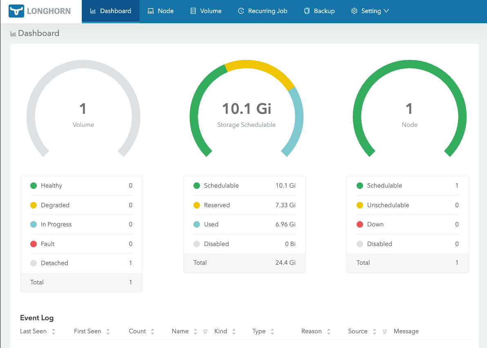

Great!

---

## 4. Deploy PostgreSQL on microk8s with CloudNativePG

### Tasks Overview

1. Install CloudNativePG using `helm`.
2. Edit `cnpg-values.yaml`.
3. Edit `postgers-cluster.yaml`.
4. Start a postgres cluster.

### Details

#### 1. Install CloudNativePG using `helm`.

It is not that we install postgreSQL and add failover function with CloudNativePG (cnpg), but the other way around. 

We will first install the failover frame work CloudNativePG, and add postgreSQL cluster to it. 
CloudNativePG not only takes care  of automatic failover but also schedules backup, exporter for Prometheus and much more. 

Check [the document](https://cloudnative-pg.io/documentation/1.25/quickstart/).

Add cnpg repo. 

```
helm repo add cnpg https://cloudnative-pg.github.io/charts
helm repo update
help repo list
```

#### 2. Edit `cnpg-values.yaml`.

It seems, one can set an indentical parameter in `*values.yaml` and cluster configuration file `postgres-cluster.yaml` that we will create. In order to avoid confusion, we edited `cnpg-values.yaml' like this.

```yaml
cloudnative-pg:
  clusterName: pg-cluster
#  instances: 2  # 1x primary + 1x secondary
#  instances: 3  # 1x primary + 2x secondary
#  storage:
#    size: 1Gi
#    storageClass: longhorn  # use longhorn
#  volumeAttributes:
#    numberOfReplicas: 1
#  volumeResizing: true
  postgresql:
    version: "15"
    parameters:
      shared_buffers: "256MB"
      max_connections: "100"
  securityContext:
    fsGroup: 0
  superuserSecret:
    name: pg-superuser-secret
  backup:
    enabled: false

```

Then start cnpg with helm.

```sh
helm install cnpg cnpg/cloudnative-pg \
       -f cnpg-values.yaml \
       --namespace postgres-cluster \
       --create-namespace
```


Check it.
```
k get all -n postgres-cluster
``` 


#### 3. Edit `postgers-cluster.yaml`.

We are looking at 3 instance cluster, one primary, and two secondary. Therefore the number of instances we will create is 3.  

```
$ cat postgres-cluster.yaml
# Example of PostgreSQL cluster
apiVersion: postgresql.cnpg.io/v1
kind: Cluster
metadata:
  name: postgres-ha
  namespace: postgres-cluster

spec:
  instances: 3

  storage:
    size: 1Gi
    storageClass: longhorn

  superuserSecret:
    name: pg-superuser-secret

  replicationSlots:
    highAvailability:
      enabled: true

  primaryUpdateMethod: switchover
```

#### 4. Start a postgres cluster.

Now we are ready to start postgres cluster. 


```
k create -f postgres-cluster.yaml
```


Check it.
```
k get po -n postgres-cluster -w
```

Check if three volumes (one volume for each instance)
are created on Longhorn. 

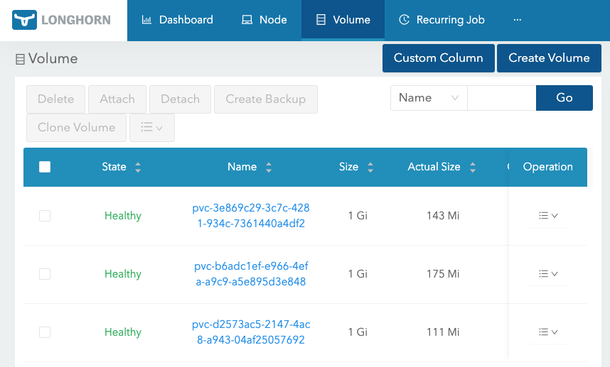

It is not that 3 postgres instances (one primary and two secondaries) share one storage, but each of them has its own storage. When failover happens, a secondary takes over the storage of the primary. 

## 5. Test failover of PostgreSQL

### Tasks Overview

1. Check if we can get into postgres.
2. Check which one is the primary.
3. Test if the cluster really does a failover

### Details

#### 1. Check if we can get into postgres.

Let us get into the context with the namespace `postgres-cluster` to save typing. 

```
k config set-context --current --namespace postgres-cluster
```

We have 3 instances in high-availability formation. 

```
$ k get po 
NAME                                   READY   STATUS    RESTARTS   AGE
cnpg-cloudnative-pg-6f9846bd9d-q9qfd   1/1     Running   0          8m59s
postgres-ha-1                          1/1     Running   0          7m23s
postgres-ha-2                          1/1     Running   0          6m38s
postgres-ha-3                          1/1     Running   0          6m
```

Get into `postgres-ha-1`.
```
kubectl exec -it postgres-ha-1 --  sh
Defaulted container "postgres" out of: postgres, bootstrap-controller (init)
$ psql
psql (17.2 (Debian 17.2-1.pgdg110+1))
Type "help" for help.
```

All right. 

#### 2. Check which one is the primary.

Let us check which one is the primary.

``` 
kubectl exec -it postgres-ha-1 -- psql -U postgres -c "SELECT * FROM pg_stat_replication;"

```
We should see the content of `pg_stat_replication`, which is a table to show which secondaries the primary knows. 

```
kubectl exec -it postgres-ha-2 -- psql -U postgres -c "SELECT * FROM pg_stat_replication;"
```

The view should be empty, because `postgres-ha-2` is a secondary. 

Same for `postgers-ha-3`.

```
kubectl exec -it postgres-ha-3 -- psql -U postgres -c "SELECT * FROM pg_stat_replication;"
```

#### 2. Test if the cluster really does a failover

Then delete `postgers-ha-1`.

```
$ k delete po postgres-ha-1
pod "postgres-ha-1" deleted
```

It will comes back soon, as it a part of a deployment, 

```
$ k get po
NAME                                   READY   STATUS    RESTARTS   AGE
cnpg-cloudnative-pg-6f9846bd9d-q9qfd   1/1     Running   0          16m
postgres-ha-1                          1/1     Running   0          29s
postgres-ha-2                          1/1     Running   0          13m
postgres-ha-3                          1/1     Running   0          13m
```

but  `postgers-ha-2` or `postgers-ha-3` should have already taken over primary's job while `postgers-ha-1` is absent. 


```
kubectl exec -it postgres-ha-2 -- psql -U postgres -c "SELECT * FROM pg_stat_replication;"
```

Empty.

```
kubectl exec -it postgres-ha-3 -- psql -U postgres -c "SELECT * FROM pg_stat_replication;"
```
Filled. It was `postgers-ha-3` that takes over the primary. 

```
kubectl exec -it postgres-ha-1 -- psql -U postgres -c "SELECT * FROM pg_stat_replication;"
```

Empty. 

All right. 

---

## What did not work out / Mistakes

1. **Ubuntu Desktop → Ubuntu Server**

Make sure you have installed **Ubuntu Server** after setting up the VM:

```sh
lsb_release -a
cat /etc/*release*
dpkg -l | grep ubuntu-desktop
```


2. **Minimum requirements:**
   - **2 vCPU**
   - **4 GiB RAM**
   - **20 GiB storage**

I started with 1 vCPU and 1 GiB RAM and microk8s was unbearably slow.  


3. `multipass`
... is an attractive option to start a VM but did not work out.

`multipass` is offered from Canonical (=Ubuntu's official maintiner),
and can create an ubuntu virtual machine in a simple manner.

See [multipass](https://canonical.com/multipass/install).

We only need to configure

- `cloud-config.yaml'

and execute

```
multipass launch --name micro \
   --cloud-init cloud-config.yaml \
   --cpus 2 \
   --memory 4G \
   24.04
```

Some useful commands for multipass.

```
multipass list
multipass stop micro
multipass delete micro
multipass purge
multipass networks
multipass find
multipass help

```


The problems are

- It was not easy to set up on Mac OSX, but it worked out. [See](https://news.ycombinator.com/item?id=30265899).

- `multipass` uses bridge network and at that time I did not understand that type
of network very well.


4. Bridge network for VMs

Make sure a bridge network for VM is not similar to a bridge network
for Kubernetes. What makes it complicated is that a bridge network
for Kubernetes is rather similar to NAT network for VMs.

Here we discuss a bridge network for VMs.

With bridge network a VM is placed on the same subnet with the host.
If you are working at home, the VM is added to your home network.

This is convenient, as the connection between VM and host works in
both direction without settings anything further (we do not need port
forwarding like in the case of NAT network). A bridge network also enables
communications between VMs as well. 

Bridge network must be craeted on OS.
[See](https://support.apple.com/en-gb/guide/mac-help/mchld53dd2f5/15.0/mac/15.0)

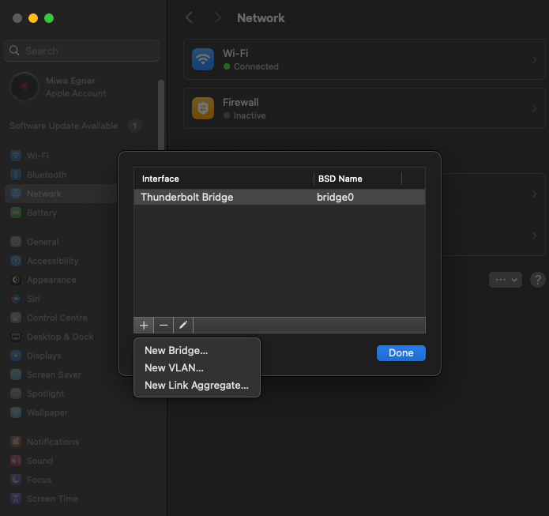

However, a bridge network is also expose a VM to the home network, in
a sense, in a naked manner. A VM is a lab for an experiment. We therefore
decided against a bridge network.

Useful commands for troubleshoot a bridge network.

```
ifconfig | grep bridge
ifconfig bridge0

ip link show bridge0
ip route

sudo ifconfig bridge0 192.168.178.1 netmask 255.255.255.0 up
nmap -sn 192.168.X.0/24  (check what is on the network)

VBoxManage list bridgedifs
VBoxManage modifyvm "micro" --nic1 bridged --bridgeadapter1 bridge0
VBoxManage natnetwork remove --netname "NatNetwork"
VBoxManage dhcpserver remove --netname "bridge0"


sudo ifconfig bridge0 up
sudo ifconfig bridge0 addm en1
sudo ifconfig bridge0 deletem en1
sudo ifconfig bridge0 192.168.X.X netmask 255.255.255.0 up
```


5. Yet another option to start a VM is to use ova file and import an appliance.
[See](https://documentation.ubuntu.com/public-images/en/latest/public-images-how-to/run-an-ova-using-virtualbox/).


6. Choice of loadbalaner/automatic failover for PostgresSQL.

See this blog
[for choices](https://blog.palark.com/comparing-kubernetes-operators-for-postgresql/).

See tis blog for [CloudNativePG](https://blog.palark.com/cloudnativepg-and-other-kubernetes-operators-for-postgresql/).

7. How to uninstall Longhorn clean. 

It was not easy. We ended up removing whole namespace
`longhorn-system`, but that was not easy either.
Follow these steps. The problem was `Finalizer` and webhooks that would allow us just to delete the resources 
in a simple manner. 

i. Make sure finalizers would not remain.

```
kubectl delete -n longhorn-system volumes.longhorn.io --all
kubectl delete -n longhorn-system nodes.longhorn.io --all
kubectl delete -n longhorn-system replicas.longhorn.io --all
kubectl delete -n longhorn-system engines.longhorn.io --all
kubectl delete -n longhorn-system instanceManagers.longhorn.io --all
kubectl delete -n longhorn-system backingImages.longhorn.io --all
kubectl delete -n longhorn-system backups.longhorn.io --all
kubectl delete -n longhorn-system settings.longhorn.io --all
```

ii. Delete webhooks. 
```
kubectl delete validatingwebhookconfiguration longhorn-admission-webhook
kubectl delete mutatingwebhookconfiguration longhorn-webhook-mutator

```

iii. Delete namespace.
```
 kubectl delete ns longhorn-system
```

 iv. When the process before hangs, remove finalizer.
```
kubectl get ns longhorn-system -o json | jq '.spec.finalizers=[]' | kubectl replace -\
-raw "/api/v1/namespaces/longhorn-system/finalize" -f -

```


---


# END

