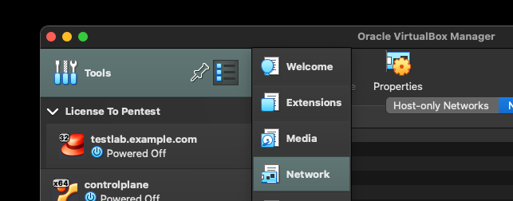

# PostgreSQL on microk8s

## Motivation

We aim to conduct experiments running PostgreSQL on a microk8s cluster. Our goals include:

- Evaluating whether it is reasonable to run PostgreSQL on a microk8s cluster.
- Setting up a high-availability configuration with one primary and two secondaries.
- Implementing automatic failover using Stolon.
- Utilizing external persistent storage provided by Longhorn.

---
## Overview

1. Create a VM
2. Install microk8s on the VM
3. Deploy Longhorn on microk8s
4. Deploy PostgreSQL on microk8s with LoadBalancer Stolon
5. Test failover of PostgreSQL


---

## 1. Create a VM

### Tasks Overview

1. Create a NAT network on VirtualBox.
2. Download an ISO image.
3. Create a VM with the ISO image, setting up a user and a password.
4. Connect the VM to the NAT network before starting it.
5. Set up Port Forwarding before starting the VM.
6. Start the VM.
7. Log in to the VM and start the SSH server.
8. Copy the SSH public key from the host to the VM using Port Forwarding.

### Details

There are a few options for creating a VM:

- **VirtualBox**

  - Bridge network
  - NAT network

- **Multipass** (Canonical, Ubuntu official)

  - NAT network

We chose VirtualBox with NAT network. After trying all of the above, we found that **VirtualBox + NAT** was the most reasonable setup.

#### 1. Create a NAT network on VirtualBox

Open VirtualBox Manager (UI). Go to `Tools` (left column) → `NAT Networks` → `Create` (`+` button).



A NAT network named **"NatNetwork"** with the default subnet **10.0.2.0/24** will be created.


#### 2. Download an ISO image

Download an ISO image from the [Ubuntu website](https://jp.ubuntu.com/download). Make sure to download **Ubuntu Server**, not the Desktop version.

#### 3. Create a VM with the ISO image, setting up a user and a password

Go to `Machine` from VirtualBox Manager and choose `New`.


Attach the ISO image and configure the VM.


Set up:

- Admin user and password
- Hostname and domain


- Minimum requirements:
  - **2 vCPU**
  - **4 GiB RAM**
  - **25 GiB storage**


#### 4. Connect the VM to the NAT network before starting

Before starting the VM, connect its virtual NIC to the NAT network.


|               | NAT network | Host-only network | Bridge network |
| ------------- | ----------- | ----------------- | -------------- |
| VM → Internet | ✅           | ❌                 | ✅              |
| VM → Host     | ✅           | ✅                 | ✅              |
| VM → VM       | ❌           | ❌                 | ✅              |
| Host → VM     | ❌           | ❌                 | ✅              |

We initially tried the **bridge network**, but abandoned it (see **What did not work out** at the end of this document).

Since `host → VM` communication is not available in a NAT network, we need to set up **Port Forwarding** next.

#### 5. Set up Port Forwarding before starting the VM

Use the VirtualBox CLI on the **host** terminal:

```sh
VBoxManage modifyvm "micro" --natpf1 "guestssh,tcp,,2222,,22"
VBoxManage modifyvm "micro" --natpf1 "kubectl_proxy,tcp,,8081,,8081"
VBoxManage modifyvm "micro" --natpf1 "apiserver,tcp,,16443,,16443"
```

These commands set up:

- **SSH port forwarding** (allows SSH from the host to the VM)
- **Kubernetes API access** (enables `kubectl proxy` from the host)
- **Kubernetes API port** (allows direct access to the microk8s API from the host)

#### 6. Start the VM

Select the VM in VirtualBox Manager and click the **Start** button (green arrow).

#### 7. Log in to the VM and start the SSH server

Log in to the VM **from the VM console** (since SSH is not yet available from the host). Use the admin account you set up.

If you see a **desktop environment**, it means you installed **Ubuntu Desktop** instead of Ubuntu Server.

Run the following:

```sh
sudo apt update
sudo apt upgrade -y
sudo apt install -y openssh-server
```

Start the SSH server:

```sh
sudo systemctl start sshd
```

Enable SSH on boot:

```sh
sudo systemctl enable sshd
```

#### 8. Copy the SSH public key from the host to the VM using Port Forwarding

On the **host**:

```sh
ssh -p 2222 admin@127.0.0.1
```

This forwards the request to **port 22** on the VM.

Copy and paste the content of `~/.ssh/id_ed25519.pub` from the **host** to `~/.ssh/authorized_keys` on the **VM**.

Add an alias in `.zshrc` on the **host**:

```sh
alias micro="ssh -p 2222 admin@127.0.0.1"
```

Reload:

```sh
source ~/.zshrc
```

Test:

```sh
micro
```

You should now be able to SSH into the VM **without a password**.

---

## 2. Install microk8s


### Tasks Overview

1. Install microk8s with `snap`
2. Add yourself to the `microk8s` group
3. Open proxy with `microk8s.kubectl proxy`
4. Copy `.kube/config` to the host machine with `scp`
5. Edit `.kube/config` for port forwarding
6. Test operation from the host machine
7. Housekeeping tasks

### Details

#### 1. Install microk8s with `snap`

Log in to the VM from the host and execute

```
sudo snap remove microk8s --classic
```


#### 2. Add yourself to microk8s group

Execute

```
sudo usermod -a -G microk8s $USER
newgrp microk8s
```

So that you have a permission to execute the command ```microk8s```.
Update the user group ```microk8s```.

Test it.
```
$ microk8s.kubectl get nodes
NAME    STATUS   ROLES    AGE   VERSION
micro   Ready    <none>   17h   v1.31.5
```

Great.

Enable a few add-ons.

```
microk8s enable dns
microk8s enable dashboard
microk8s enable metric-server
microk8s enable ingress
microk8s enable storage
```

Restart microk8s with add-ons. 

```
sudo systemctl restart snap.microk8s.daemon-containerd.service
```

#### 3. Open proxy with microk8s.kubectl proxy

Let us test if we can connect from the host to microk8s cluster
(single-node cluster in our case).

On **VM**

```
microk8s.kubectl proxy \
   --address=10.0.2.X\   <---- IP of VM
   --accept-hosts='\^XXX\.XXX\.XXX\.XXX$' \ <---- IP of host
   --port=8081 <--- port to use
```

When you execute the command above, you would not come back to the
command prompt. You should keep it so, because this means now the
port is open. When you do Ctl+c, and quit, the port will be closed.  

on **host**

```
curl http://127.0.0.1:8081/api/
Forbidden
```

This is the right outcome.

#### 4. Copy .kube/config to the host machine with scp

First extract config from the cluster

On **VM**

```
microk8s config > .kube/config
```

Copy it to the host. On **host**

```
scp -P 2222 user_name@127.0.0.1:/home/user_name/.kube/config ~/
```

It looks as if you are copying from your own host, because we are port
forwarding to the VM. A request to 127.0.0.1:2222 will forwarded to
port 22 of the VM.

Check if you have config now.

```
$ cat config
```

Then move it to the right directory

```
$ mkdir ~/.kube
$ mv config ~/.kube/

```

#### 5. Edit .kube/config for port forwarding

This config file does not work as it is, because we are using port forwarding.
Look for 

```
server: https://10.0.2.15:16443
```
in config and change it to 

```
server: https://127.0.0.1:16443 
```

Now test on **host**
```
$ kubectl get no
NAME    STATUS   ROLES    AGE   VERSION
micro   Ready    <none>   17h   v1.31.5
```

All right. 

Take care a few housekeeping stuff.

On **VM**

```
sudo snap alias microk8s.kubectl k source <(k completion bash |
sed "s/kubectl/k/g")
```

so that we can execute ```microk8s.kubectl``` with `k` only with an
autocompletion.

On **host** add following lines in ```.zshrc```.
```
alias k="kubectl"
```

---

## 3. Deploy Longhorn on microk8s
### Tasks Overview

1. Enable the Helm 3 add-on for microk8s.
2. Deploy Longhorn using Helm.
3. Modify the Longhorn deployment to set the `kubelet` directory.
4. Set up `kubectl port-forward` for the Longhorn dashboard.
5. Access the Longhorn dashboard from the host.

### Details

#### 1. Enable Helm 3 add-on for microk8s

On **VM**:
```sh
microk8s enable helm3
```

Verify that `helm3` is enabled:
```sh
microk8s.helm version
```

For convenience, create an alias:
```sh
alias helm=microk8s.helm
```

#### 2. Deploy Longhorn using Helm

Add the Longhorn Helm repository:
```sh
helm repo add longhorn https://charts.longhorn.io
helm repo update
```

Install Longhorn on the microk8s cluster:
```sh
helm install longhorn longhorn/longhorn \
             --namespace longhorn-system \
             --create-namespace
```

If something goes wrong, roll back the installation:
```sh
helm uninstall longhorn -n longhorn-system
```
or delete the entire namespace:
```sh
kubectl delete ns longhorn-system
```

To clean up the Custom Resource Definitions (CRDs):
```sh
kubectl delete crd $(kubectl get crd | grep longhorn | awk '{print $1}')
```

Remove log directories:
```sh
sudo rm -rf /var/lib/longhorn/
```

Then restart the cluster:
```sh
microk8s stop
microk8s start
```

#### 3. Modify the Longhorn deployment for `kubelet` directory

Check if Longhorn is running. This can also be done from the host:
```sh
kubectl config set-context --current --namespace longhorn-system
kubectl get po
```

If `longhorn-driver-deployer` is not working, check the logs:
```sh
kubectl logs longhorn-driver-deployer-XXX
```

The `longhorn-driver-deployer` may fail to locate the `kubelet` root directory. To fix this, update the deployment.

Save the configuration of `longhorn-driver-deployer`:
```sh
kubectl get deployments longhorn-driver-deployer -o yaml > longhorn-driver-deployer.yaml
```

Add the last line below:
```yaml
    spec:
      containers:
      - command:
        - longhorn-manager
        - -d
        - deploy-driver
        - --manager-image
        - longhornio/longhorn-manager:v1.8.0
        - --manager-url
        - http://longhorn-backend:9500/v1
        - --kubelet-root-dir=/var/lib/kubelet
```

Apply the update:
```sh
kubectl replace -f longhorn-driver-deployer.yaml --force
```

Check if `longhorn-driver-deployer` is now running:
```sh
kubectl get po
```

#### 4. Set up `kubectl port-forward` for the Longhorn dashboard

To access the Longhorn dashboard from the host, set up port forwarding.
Execute the following command on either the **host** or **VM**:
```sh
kubectl port-forward -n longhorn-system service/longhorn-frontend 8080:80
```

This forwards port 80 of the `longhorn-frontend` service (inside the `longhorn-system` namespace) to port 8080 on the host.

#### 5. Access the Longhorn dashboard from the host

Open the following URL in a web browser on the **host**:
```sh
http://localhost:8080
```

If everything is set up correctly, the Longhorn dashboard should be accessible.


Great!

---

## 4. Deploy PostgreSQL on microk8s with LoadBalancer Stolon

## 5. Test failover of PostgreSQL

### Tasks Overview

---

## What did not work out / Mistakes

1. **Ubuntu Desktop → Ubuntu Server**
2. **Minimum requirements:**
   - **2 vCPU**
   - **4 GiB RAM**
   - **20 GiB storage**

Make sure you have installed **Ubuntu Server** after setting up the VM:

```sh
lsb_release -a
cat /etc/*release*
```

---

# END

